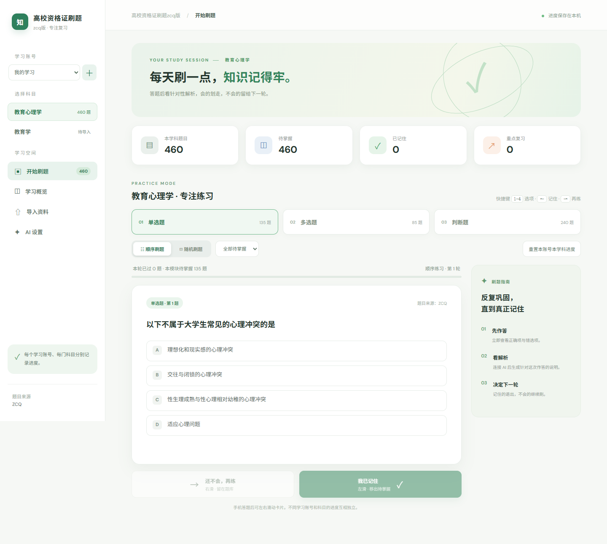
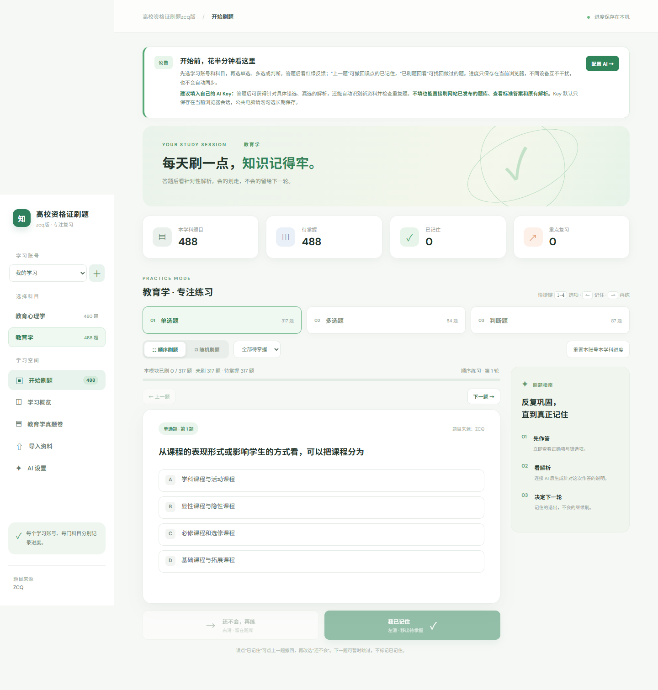
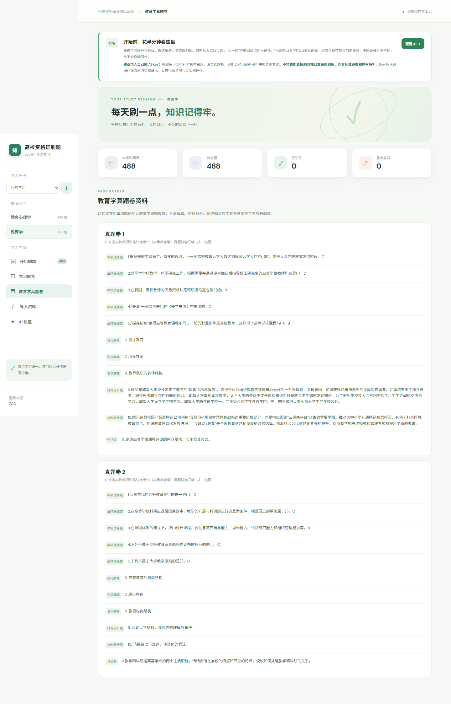
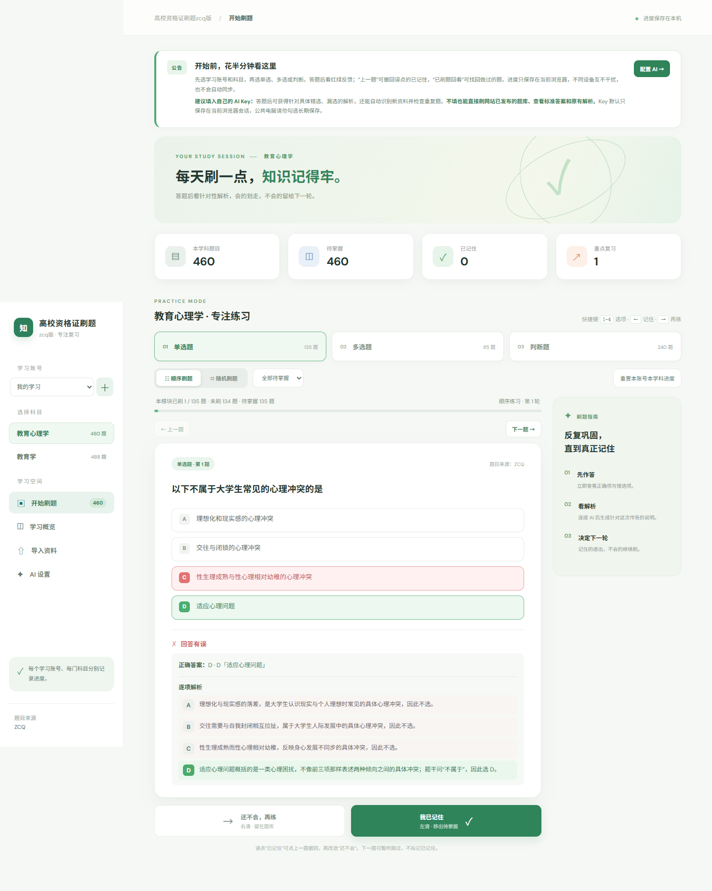
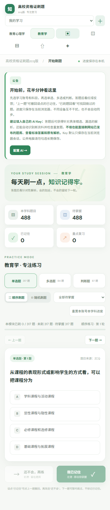
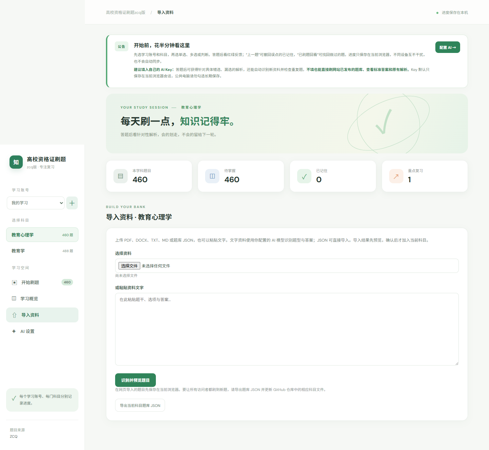
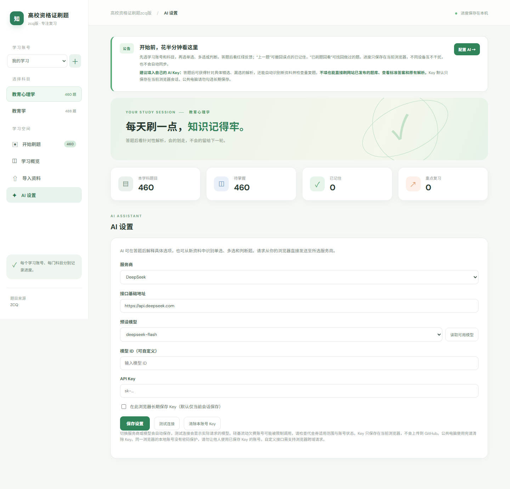

# 高校资格证刷题 zcq 版

面向高校教师资格证复习的轻量刷题网站，题目来源：**ZCQ**。打开即用，支持电脑与手机，不需要注册；每个学习账号、每门科目分别保存自己的刷题进度。

**在线使用：** [打开高校资格证刷题 zcq 版](https://zcq19991029.github.io/education-psychology-quiz/)



## 功能一览

| 模块 | 能做什么 | 配图 |
| --- | --- | --- |
| 分科目刷题 | 教育心理学、教育学独立管理；单选、多选、判断三个模块互不混淆 |  |
| 顺序与随机 | 按顺序练习，或随机抽题；只刷当前选择的题型 |  |
| 即时反馈 | 选项即时标记绿色/红色，显示正确答案和 A-D 逐项解析 |  |
| 移动端刷题 | 卡片滑动：左滑“已记住”，右滑“还不会，再练” |  |
| 沉浸式刷题 | 从左侧栏进入，全屏只保留题目与解析，按 Esc 返回 |  |
| 导入资料 | 支持 JSON、PDF、DOCX、TXT、MD 与粘贴文本；导入前预览、识别题型、检查重复题 |  |
| AI 解析 | 可接入 DeepSeek、硅基流动或自定义 OpenAI 兼容接口，生成针对本次作答的解析 |  |
| 数据统计 | 分题型显示已刷、待掌握、已记住、重点复习；刷新后继续保留 |  |

## 推荐使用流程

1. 左侧选择学习账号与科目，再选择单选、多选或判断。
2. 使用“顺序刷题”或“随机刷题”，选择答案后查看逐项解析。
3. 记住的题点击“我已记住”；不确定的题点击“还不会，再练”。误点可以用“上一题”撤回。
4. 首次打开会弹出使用公告，之后可从左侧“使用公告”再次查看；“刷题指南”和“检查更新”也在左侧栏。
5. 需要实时解析、自动识别导入题型或检测重复题时，在“AI 设置”中填写自己的 API Key。Key 只保存在当前浏览器，不会写入仓库或发送给其他用户；不填写也可使用内置题库和标准解析。

## AI 设置与费用说明

支持预设模型与自定义模型 ID。DeepSeek 或硅基流动账户欠费、代金券不可用、模型权限不足时，平台仍可能返回欠费或权限错误；网站不会绕过供应商计费规则。可切换到账号实际可用的模型，并使用“测试连接”确认。

## 隐私与进度隔离

所有刷题记录、AI Key、账号和科目进度默认保存在当前浏览器的 localStorage，不会自动同步到 GitHub，也不会与其他人的浏览器互相影响。清除浏览器站点数据会删除本机记录，请先使用导出功能备份题库。

## 本地运行

需要 Node.js 18+：

```powershell
npm start
```

然后打开 <http://127.0.0.1:8000>。GitHub Pages 会在 `main` 分支更新后自动部署。

## 题库数据

- 教育心理学：单选 135、多选 85、判断 240，共 460 题。
- 教育学：独立题库，切换科目后不会混入教育心理学进度。
- 题库文件：[`data/questions.json`](data/questions.json)、[`data/education.json`](data/education.json)。

## 许可证与来源

本项目为个人学习工具。题目来源标记为 **ZCQ**；请仅用于个人复习，并尊重原始资料版权。
