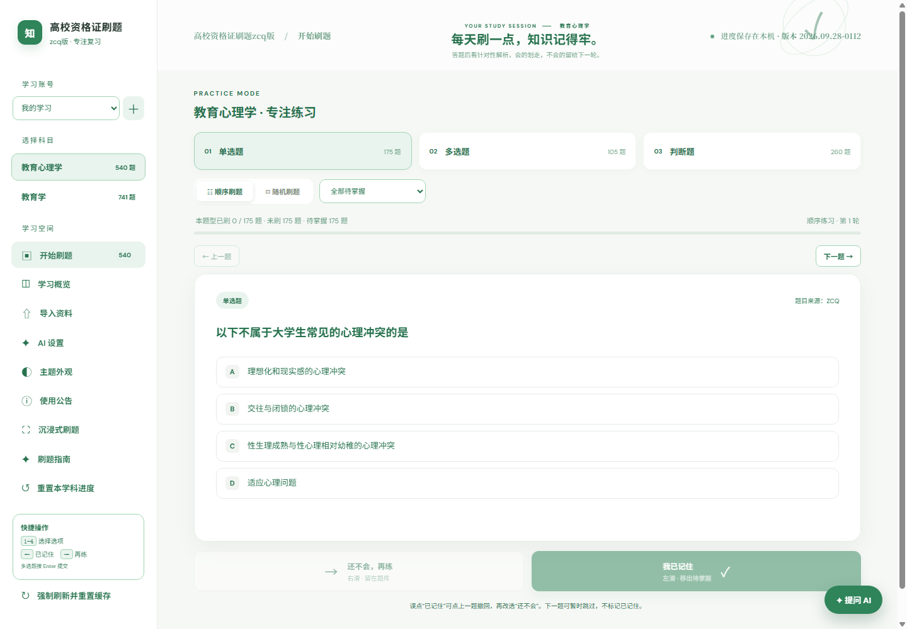
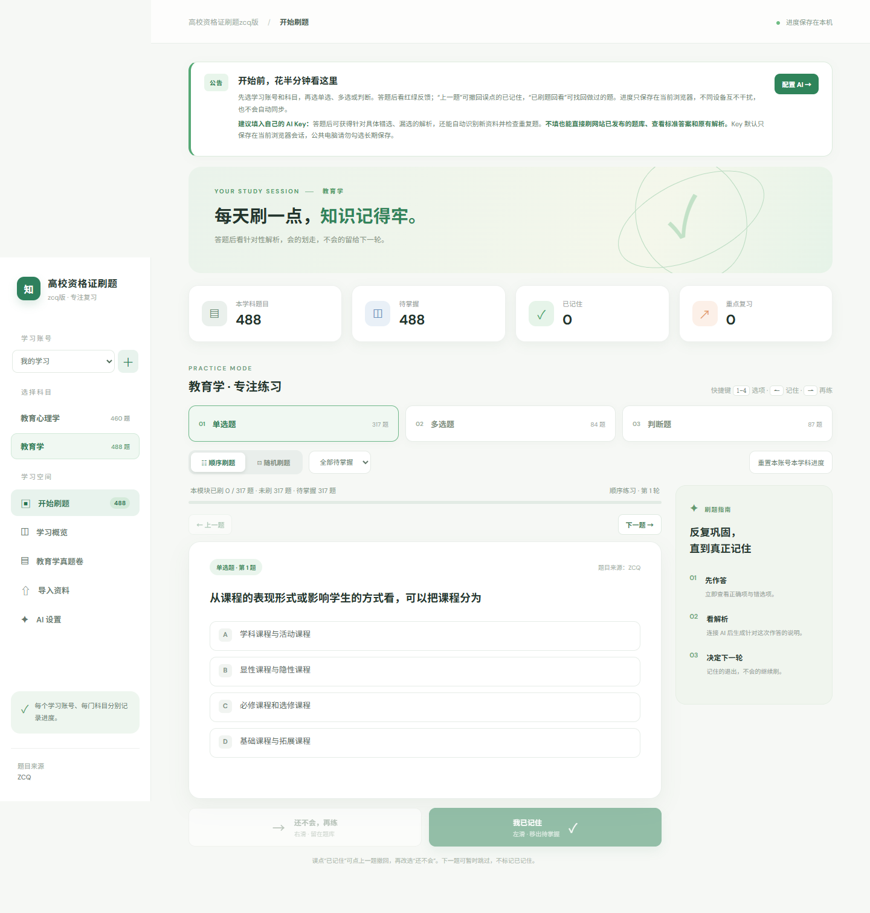
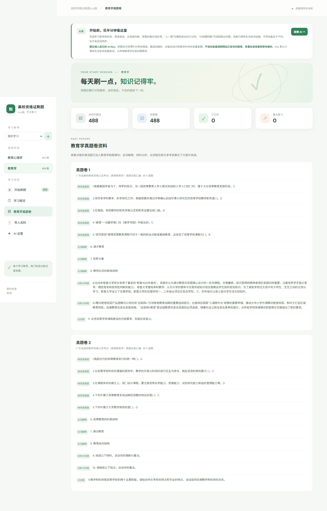
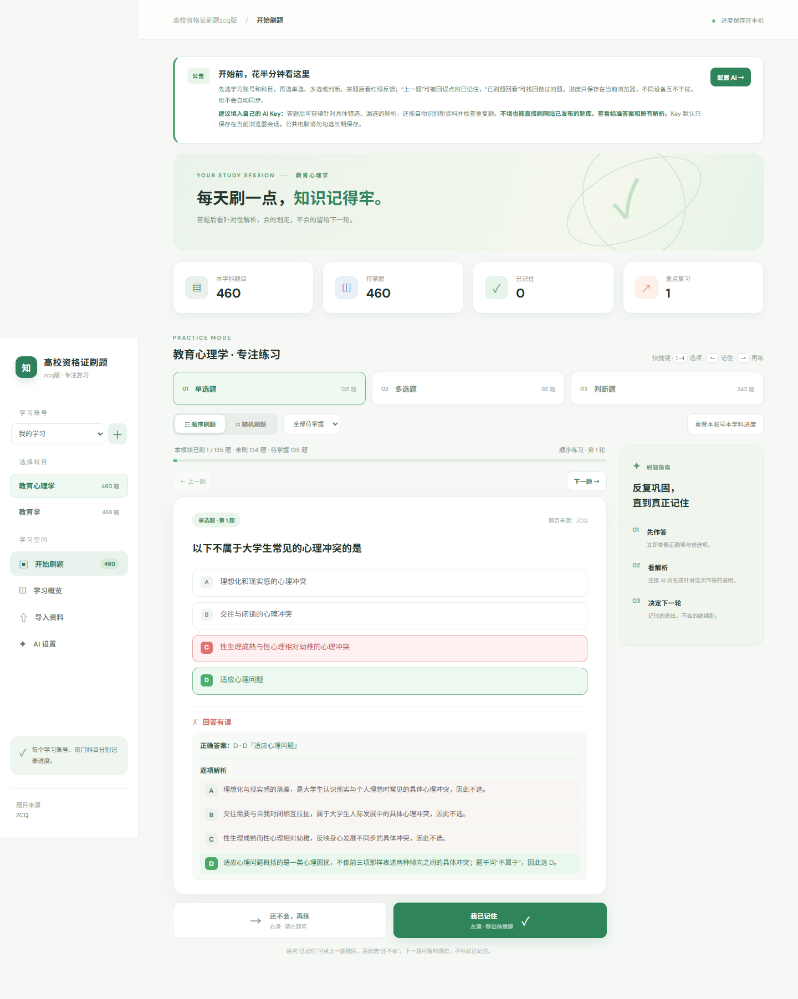
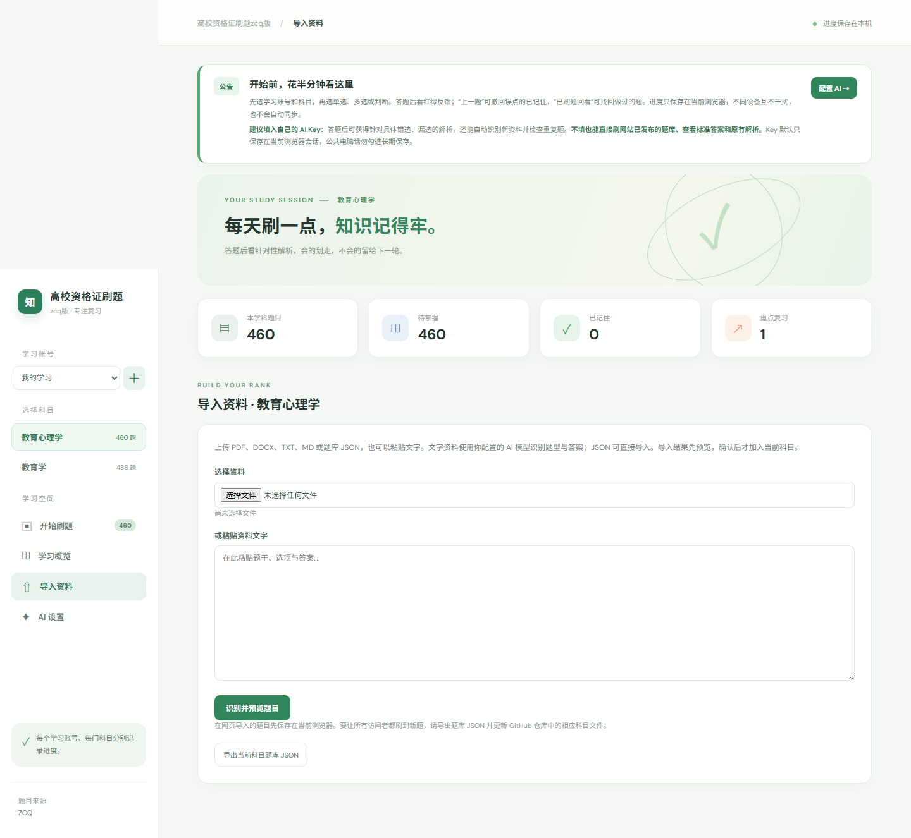
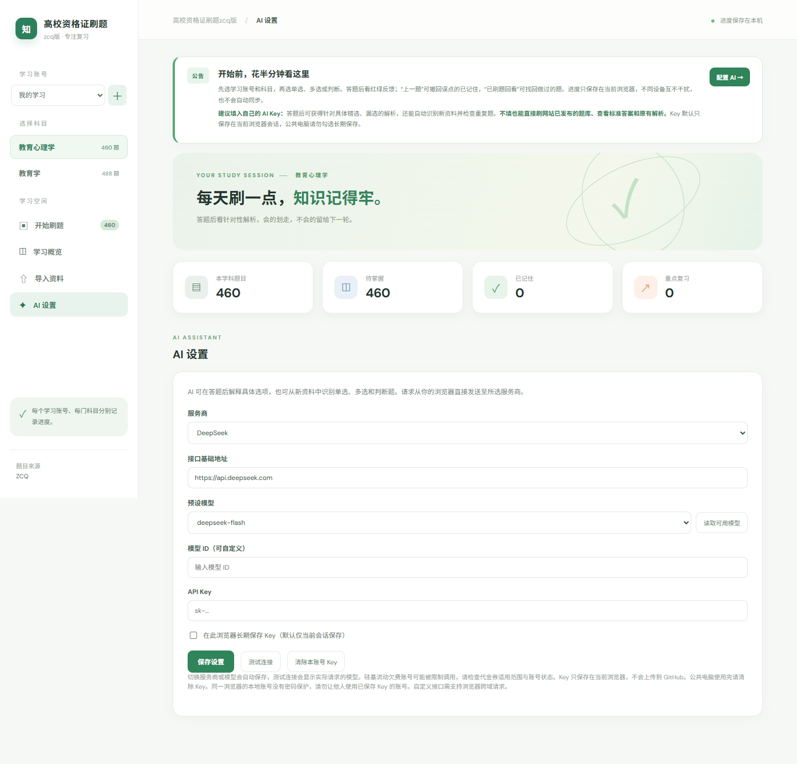
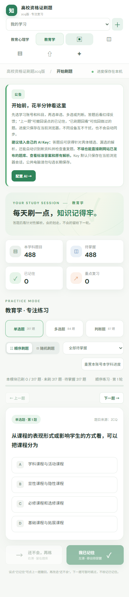

# 高校资格证刷题 zcq 版

面向高校教师资格证复习的轻量刷题网站，题目来源标记为 **ZCQ**。支持电脑、手机和触控屏；不需要注册，学习账号、科目和刷题记录分别保存在当前浏览器。

**在线使用（Sites 版）：** [打开高校资格证刷题 zcq 版](https://education-psychology-quiz-sites.zcq991029.chatgpt.site/)

**源码仓库：** [zcq19991029/education-psychology-quiz](https://github.com/zcq19991029/education-psychology-quiz)



> 当前界面发布标记：`2026.09.28-0112`。上图包含新版侧栏、题型计数、公告、快捷操作和“强制刷新并重置缓存”入口。

## 最新功能

### 题库、题型与刷题范围

- **教育心理学**和**教育学**分开保存进度；单选、多选、判断三个题型也分别统计，不会把不同题型混在一起。
- 支持顺序刷题和随机刷题。每次点击“随机刷题”都会重新生成一轮随机顺序，不会只在第一次随机。
- 可筛选“全部待掌握、错题强化、尚未作答、已刷题回看、已记住回看 / 移回待掌握”。
- “上一题”可以撤回误点的记忆分类；已刷题回看可以重新作答，不会破坏原来的作答记录。
- 支持键盘 `1-4` 选项、`←` 记住、`→` 再练，以及移动端卡片滑动。

| 科目 | 单选 | 多选 | 判断 | 合计 |
| --- | ---: | ---: | ---: | ---: |
| 教育心理学 | 175 | 105 | 260 | 540 |
| 教育学 | 481 | 173 | 87 | 741 |

### 答案反馈与答案复核

- 作答后用固定的**红色错误 / 绿色正确**语义显示选项，不随主题色改变，保证看题时含义一致。
- 显示题库标准答案、逐项解析和本次作答结果；多选题在确认后统一判定。
- AI 复核意见会明确标注为“**AI 独立复核**”，并与题库答案分开显示。
- AI 提供候选答案时，按钮明确区分“**采用 AI 建议**”与“**保留题库答案**”。这类修改默认只保存在当前浏览器，普通学习账号不会直接改写公共题库；公共题库由维护者核对后统一更新。

### 沉浸式速通查看

从左侧“沉浸式刷题”进入后，页面只保留题目卡片和必要的切换控件，按 `Esc` 可以退出。

- “**一键显示答案**”只在沉浸式模式出现。
- 开启后会在当前题目上直接选出标准答案，题干和选项仍保留，点“下一题”即可继续查看。
- 这是临时查看模式，不提交作答、不增加已刷数量、不改变“已记住 / 待掌握 / 错题”状态；关闭后恢复正常作答。
- 速通状态显示当前队列位置和“后面还有多少题”，方便快速浏览整套题目。

### 主题外观与背景

“主题外观”提供：默认绿、静谧蓝、暮紫、暖杏、樱粉、朱红、黑白七种预设色。主题只影响界面外观，不影响题库和刷题进度。

- 正确与错误的红绿对比色固定，不会被主题覆盖。
- 可选择内置的“猫耳学习背景”，初始界面透明度为 **70%**，也可以用滑块自行调整。
- 支持上传小于 3 MB 的自定义背景图；主题和透明度保存在当前浏览器。

### 导入资料与 AI

- “导入资料”支持 JSON、PDF、DOCX、TXT、MD 和粘贴文本。
- 导入前会预览题目、识别单选 / 多选 / 判断、编辑答案，并检查疑似重复题和答案冲突。
- “AI 设置”支持 DeepSeek、硅基流动和自定义 OpenAI 兼容接口；可自定义模型 ID、读取可用模型、测试连接和清除当前账号 Key。
- 右下角“提问 AI”可进行独立问答，可选择引用当前题目，但不会把题库标准答案当作唯一结论。
- API Key 由浏览器直接发送到所选服务商，不上传到本仓库；公共电脑使用完应清除 Key。

### 更新、缓存与本机数据

- 左侧“**强制刷新并重置缓存**”会清理页面缓存和 Service Worker 后重新加载资源。
- 该操作不会清除账号、主题、本地题库或刷题记录；这些数据保存在当前浏览器的 localStorage / IndexedDB。
- 不同浏览器、不同电脑之间不会自动同步。清除浏览器站点数据前，请先导出题库并确认是否需要保留本机进度。

## 两种打开方式

### 在线版或本地开发版

`index.html` 使用外部 `styles.css`、`app.js` 和 ES Module，适合 Sites 版或本地服务器：

```powershell
npm start
```

然后打开 <http://127.0.0.1:8000>。直接双击开发版 `index.html` 时，部分浏览器会因 `file://` 的模块安全策略拦截脚本，出现“正在加载题目”不动；这不是刷题记录缓存造成的。

### 教室 U 盘单文件版

仓库中的 [`课堂版.html`](课堂版.html) 是已经内嵌 CSS、JavaScript 和题库数据的独立文件。到教室时只需要复制这一个文件，双击即可打开，不需要 Node.js、Python、插件或本地服务。

更新课堂文件时要替换完整的新版 `课堂版.html`。如果拿的是开发版文件夹，则必须连同 `index.html`、`app.js`、`styles.css`、`data/` 和 `vendor/` 一起更新，不能只替换一个 HTML 文件。

## 配图索引

| 截图 | 内容 |
| --- | --- |
|  | 当前桌面端、题型计数、侧栏工具和公告 |
|  | 教育学独立题库 |
|  | 真题卷和题型入口 |
|  | 红绿反馈、标准答案和逐项解析 |
|  | 资料导入、预览与重复题检查 |
|  | 服务商、模型和 API Key 设置 |
|  | 移动端刷题布局 |

## 题库文件

- 教育心理学：[`data/questions.json`](data/questions.json)
- 教育学：[`data/education.json`](data/education.json)
- 教育学真题卷：[`data/education-papers.json`](data/education-papers.json)

## 许可证与来源

本项目为个人学习工具。题目来源标记为 **ZCQ**；请仅用于个人复习，并尊重原始资料版权。
